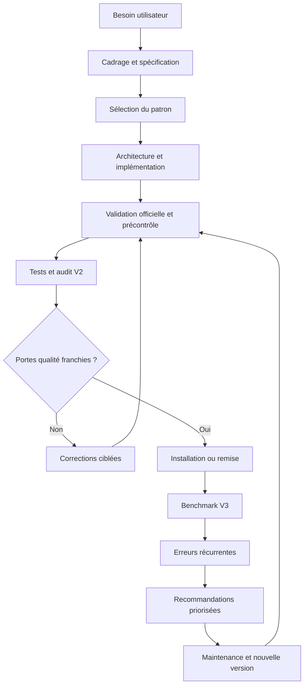
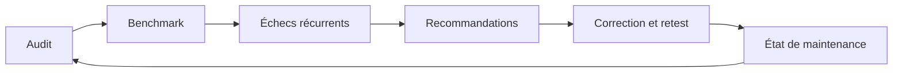

# Skill Factory

> **La chaîne de production V3 pour concevoir, tester, auditer, comparer et améliorer des skills personnels fiables.**

[](./SKILL.md)
[](./references/evaluation-rubric.md)
[](./references/test-patterns.md)
[](./scripts)
[](./SKILL.md)

**Skill Factory** transforme une intention parfois encore floue en un skill structuré, testable et maintenable. Il orchestre le skill officiel `skill-creator`, ajoute des portes de qualité reproductibles et organise l'amélioration continue sans confondre conformité technique et efficacité réelle.

Le projet couvre le cycle de vie complet : cahier des charges, architecture, initialisation, validation officielle, précontrôle, tests de déclenchement, audit sur 100, comparaison de versions, benchmark multi-tâches, capitalisation anonymisée des erreurs, recommandations priorisées et contrôle de maintenance.

> [!IMPORTANT]
> Ce README documente le **dépôt GitHub**. Il ne doit pas être ajouté au paquet installable du skill. Dans le ZIP d'installation, `SKILL.md` reste le point d'entrée et les rapports de test restent hors du dossier du skill.

## Sommaire

- [Pourquoi Skill Factory](#pourquoi-skill-factory)
- [Ce que le skill fait concrètement](#ce-que-le-skill-fait-concrètement)
- [Ce que le skill ne fait pas](#ce-que-le-skill-ne-fait-pas)
- [Évolution MVP → V2 → V3](#évolution-mvp--v2--v3)
- [Architecture générale](#architecture-générale)
- [Workflow détaillé en huit étapes](#workflow-détaillé-en-huit-étapes)
- [Catalogue de patrons](#catalogue-de-patrons)
- [Structure du dépôt](#structure-du-dépôt)
- [Installation](#installation)
- [Démarrage rapide](#démarrage-rapide)
- [Cas d'usage](#cas-dusage)
- [Référence des scripts](#référence-des-scripts)
- [Formats JSON](#formats-json)
- [Audit et score sur 100](#audit-et-score-sur-100)
- [Stratégie de test](#stratégie-de-test)
- [Boucle d'amélioration continue](#boucle-damélioration-continue)
- [Sécurité et confidentialité](#sécurité-et-confidentialité)
- [États et décisions](#états-et-décisions)
- [Résultats de validation du projet](#résultats-de-validation-du-projet)
- [Ajouter ou modifier un patron](#ajouter-ou-modifier-un-patron)
- [Dépannage](#dépannage)
- [Limites connues](#limites-connues)
- [Feuille de route visuelle](#feuille-de-route-visuelle)
- [FAQ](#faq)

## Pourquoi Skill Factory

Créer un skill ne consiste pas seulement à écrire un bon prompt dans un fichier Markdown. Un skill réellement exploitable doit aussi :

- se déclencher sur les bonnes demandes et rester silencieux sur les demandes voisines ;
- séparer les instructions toujours utiles des références chargées à la demande ;
- déléguer les opérations répétitives ou fragiles à des scripts testables ;
- traiter les fichiers manquants, les permissions insuffisantes et les erreurs d'outil ;
- placer une confirmation devant les actions sensibles ;
- être validé dans un contexte neuf, sans lui souffler la réponse attendue ;
- fournir des preuves observables avant d'être déclaré prêt ;
- pouvoir évoluer sans régression fonctionnelle.

| Problème courant | Réponse de Skill Factory |
|---|---|
| Le besoin est décrit trop vaguement | Génération d'un cahier des charges et explicitation des hypothèses |
| Le skill se déclenche trop souvent | Requêtes positives, négatives proches et tests discriminants |
| `SKILL.md` devient trop long | Architecture à divulgation progressive avec `references/` |
| Une transformation manuelle est fragile | Script déterministe, paramétrable et testé |
| Le dossier contient des fichiers inutiles | Précontrôle de l'arborescence et justification de chaque ressource |
| Un score flatteur masque un défaut grave | Défaillances critiques bloquantes indépendamment du score |
| Une mise à jour introduit une régression | Comparaison d'inventaire, d'empreintes et de résultats de tests |
| Les mêmes erreurs reviennent | Agrégation anonymisée par code d'erreur stable |
| Le skill vieillit silencieusement | État de maintenance et contrôle d'échéance |

## Ce que le skill fait concrètement

Selon la demande, Skill Factory peut produire ou mettre à jour :

1. **Un cahier des charges exploitable**
   - objectif, utilisateurs et résultat attendu ;
   - périmètre inclus et exclu ;
   - niveau d'autonomie ;
   - entrées, sorties et formats ;
   - risques, confirmations et conditions d'arrêt ;
   - critères d'acceptation ;
   - plan d'essais.

2. **Une architecture de skill**
   - `SKILL.md` pour le workflow essentiel ;
   - `references/` pour les connaissances détaillées ;
   - `scripts/` pour les opérations déterministes ;
   - `assets/` uniquement pour les ressources réellement réutilisées dans les livrables ;
   - `agents/openai.yaml` pour les métadonnées d'interface.

3. **Une matrice de déclenchement**
   - cas positifs ;
   - cas négatifs proches ;
   - demandes ambiguës ;
   - ressources manquantes ;
   - actions sensibles ;
   - non-régressions.

4. **Un rapport qualité avant installation**
   - validation officielle ;
   - erreurs et avertissements du précontrôle ;
   - score automatique par dimension ;
   - résultats des tests ;
   - défaillances critiques ;
   - décision et prochaine action.

5. **Une boucle V3 de maintenance**
   - sélection d'un patron d'architecture ;
   - benchmark sur plusieurs tâches ;
   - détection des erreurs récurrentes ;
   - recommandations P0, P1 ou P2 reliées à des preuves ;
   - contrôle de la prochaine revue.

## Ce que le skill ne fait pas

Skill Factory ne remplace pas :

- le skill officiel `skill-creator`, qu'il doit lire et suivre pour l'initialisation, la validation et l'installation ;
- une expertise métier lorsque le domaine est réglementé, médical, juridique, financier ou fortement spécialisé ;
- l'exécution réelle des tests par la simple génération d'une matrice ;
- une revue humaine des résultats sensibles ;
- une tâche planifiée : `maintenance_check.py` indique qu'une revue est due, mais ne crée pas de planification automatique ;
- une preuve absolue de qualité : le score automatique reste un indicateur reproductible fondé sur les éléments disponibles.

Il ne doit pas être utilisé pour une simple question générale sur les skills ni pour une installation directe lorsqu'aucun travail de conception, d'audit ou d'amélioration n'est nécessaire.

## Évolution MVP → V2 → V3

| Niveau | Objectif | Capacités principales | Sorties |
|---|---|---|---|
| **MVP** | Construire correctement | Spécification, architecture, `SKILL.md`, ressources, scripts, validation officielle, tests sur trois familles de skills | Skill structuré et dossier de spécification |
| **V2** | Mesurer et décider | Précontrôle, audit automatique, score sur 100, génération des tests, comparaison de versions, rapport final | Rapport d'audit, matrice normalisée, comparaison |
| **V3** | Apprendre et maintenir | Catalogue de patrons, benchmark multi-tâches, erreurs récurrentes, recommandations priorisées, contrôle périodique | Rapports de performance, d'échec, de recommandation et de maintenance |

La V3 inclut toutes les capacités du MVP et de la V2. Elle ne supprime aucune porte de qualité : elle ajoute une boucle d'observation après la création initiale.

## Architecture générale



### Principe de séparation

| Composant | Contenu | Chargement / usage |
|---|---|---|
| `SKILL.md` | Déclenchement et workflow indispensable | Chargé lorsqu'un skill se déclenche |
| `references/` | Règles, modèles, documentation longue | Lu uniquement quand l'étape correspondante l'exige |
| `scripts/` | Contrôles et transformations reproductibles | Exécuté pour produire des preuves observables |
| `assets/` | Modèles, images, polices ou fichiers à réutiliser | Copié ou transformé sans gonfler inutilement le contexte |
| Rapports de test | Audit, benchmark, erreurs, maintenance | Conservés **hors** du dossier installable |

## Workflow détaillé en huit étapes

### 1. Cadrer le besoin

Le skill collecte ou déduit les informations du [modèle de spécification](./references/specification-template.md). Il pose uniquement les questions dont la réponse changerait matériellement le résultat.

Le cadrage minimal comprend :

- trois requêtes qui doivent déclencher le skill ;
- trois requêtes proches qui ne doivent pas le déclencher ;
- les sorties attendues et leurs critères de réussite ;
- les outils, fichiers, sources et dépendances ;
- les actions sensibles nécessitant une confirmation ;
- les conditions d'arrêt et les solutions de repli.

**Porte de sortie :** le périmètre est assez précis pour concevoir l'architecture sans deviner les décisions importantes.

### 2. Concevoir l'architecture

Le skill applique les [règles d'architecture](./references/architecture-rules.md) et décide où placer chaque information.

Questions structurantes :

- Cette instruction est-elle indispensable à chaque exécution ?
- Cette connaissance est-elle longue, spécialisée ou rarement utile ?
- Cette opération doit-elle être strictement reproductible ?
- Cet asset sera-t-il réellement réutilisé dans un livrable ?
- Ce fichier améliore-t-il l'exécution ou explique-t-il seulement le projet ?

**Porte de sortie :** chaque fichier prévu a une fonction opérationnelle claire et aucun dossier vide n'est conservé.

### 3. Initialiser et implémenter

Skill Factory délègue la procédure officielle à `skill-creator` :

1. résolution du répertoire officiel des skills personnels ;
2. recherche d'un éventuel conflit de nom ;
3. initialisation avec les seuls répertoires nécessaires ;
4. rédaction du frontmatter avec `name` et `description` ;
5. écriture du workflow à l'impératif ou à l'infinitif ;
6. génération de `agents/openai.yaml` ;
7. test nominal et test d'échec de chaque script ajouté.

**Porte de sortie :** le skill existe dans l'emplacement autorisé, son nom est unique et les scripts fonctionnent réellement.

### 4. Valider

L'ordre attendu est strict :

1. validateur officiel fourni par `skill-creator` ;
2. contrôle complémentaire avec `preflight_skill.py` ;
3. correction de toutes les erreurs ;
4. examen individuel des avertissements ;
5. audit V2 avec `audit_skill.py`.

```bash
python3 scripts/preflight_skill.py /chemin/vers/le-skill

python3 scripts/audit_skill.py /chemin/vers/le-skill \
  --tests /chemin/vers/test-results.json \
  --official-validation passed \
  --format markdown \
  --output /chemin/vers/audit-report.md
```

**Porte de sortie :** aucune erreur structurelle, liens locaux résolus et validation officielle réussie.

### 5. Tester le comportement

La stratégie décrite dans [test-patterns.md](./references/test-patterns.md) couvre le comportement réel, pas seulement la syntaxe.

```bash
python3 scripts/generate_trigger_tests.py specification.json \
  --output trigger-tests.json
```

La matrice générée doit ensuite être **exécutée** dans un contexte neuf. Chaque observation est consignée dans `test-results.json`.

**Porte de sortie :** tous les cas critiques passent, y compris le non-déclenchement et les confirmations de sécurité.

### 6. Évaluer et décider

Le score est calculé selon la [grille d'évaluation](./references/evaluation-rubric.md). Un skill est prêt seulement si :

- aucune défaillance critique n'est présente ;
- le validateur officiel réussit ;
- le précontrôle ne retourne aucune erreur ;
- tous les tests critiques passent ;
- le score manuel atteint au moins 90/100.

Pour une mise à jour, la comparaison de versions complète la décision :

```bash
python3 scripts/compare_skills.py /chemin/ancienne /chemin/candidate \
  --old-tests old-test-results.json \
  --new-tests new-test-results.json \
  --format markdown \
  --output comparison-report.md
```

**Porte de sortie :** la version candidate améliore ou préserve le comportement sans régression critique.

### 7. Organiser l'amélioration continue

La boucle V3 suit [v3-continuous-improvement.md](./references/v3-continuous-improvement.md) :

1. sélectionner un patron ;
2. exécuter plusieurs tâches représentatives ;
3. mesurer qualité, latence, tokens, tentatives et taux de réussite ;
4. agréger les échecs sans conserver les données sensibles ;
5. relier chaque recommandation à une preuve ;
6. corriger, retester et enregistrer l'état de maintenance.

**Porte de sortie :** les améliorations proposées sont priorisées, mesurables et associées à des scénarios à retester.

### 8. Installer ou remettre le résultat

La fin du workflow dépend de l'autorisation donnée :

| Demande utilisateur | Résultat attendu |
|---|---|
| Création et installation | Skill installé puis vérifié à son emplacement officiel |
| Mise à jour | Nouvelle version validée, comparée, installée et vérifiée |
| Audit uniquement | Rapport et plan de correction, sans modification non demandée |
| Prototype | Spécification, architecture et fichiers de travail, sans installation |
| Plan uniquement | Plan d'action et décisions à prendre, sans création de fichiers |

Le compte rendu final indique toujours le statut exact : **brouillon**, **à corriger**, **prêt** ou **installé**.

## Catalogue de patrons

Le catalogue V3 contient sept patrons. `select_pattern.py` compare le résumé, les livrables, les outils et les contraintes du brief aux signaux de chaque patron.

| ID | Cas typique | Ressources probables | Tests obligatoires | Risques majeurs |
|---|---|---|---|---|
| `procedural-knowledge` | Règlement, politique, procédure versionnée | `references/` | Règle explicite, règle absente, contradiction, version applicable | Règle inventée, source obsolète |
| `deterministic-transform` | Conversion, validation, calcul, CSV/JSON | `scripts/` | Entrée valide/invalide, reproductibilité, original préservé | Corruption, perte de données |
| `brand-constrained-creative` | Charte, logo, design, templates | `references/`, `assets/` | Asset verrouillé, palette, proportions, contrôle visuel | Logo régénéré, dérive visuelle |
| `current-research` | Actualité, prix, marché, veille | `references/` | Source primaire, date, désaccord, information absente | Information périmée, source fragile |
| `external-system-operator` | API, connecteur, publication, déploiement | `references/`, `scripts/` | Lecture seule, confirmation, permission refusée, reprise | Action irréversible, mauvais destinataire |
| `multi-artifact-project` | Rapport + présentation + tableur, pipeline | `references/`, `scripts/`, `assets/` | Cohérence, ordre, reprise, livrables complets | État incohérent, fichier manquant |
| `general-workflow` | Aucun signal spécialisé suffisant | Selon besoin | Cas nominal, ambigu, erreur, non-déclenchement | Périmètre trop large |

La sélection du patron est une recommandation explicable, pas une classification opaque : le rapport expose le score, les signaux reconnus, les alternatives et les risques associés.

## Structure du dépôt

```text
skill-factory/
├── README.md                         # Documentation GitHub uniquement
├── SKILL.md                          # Workflow chargé après déclenchement
├── agents/
│   └── openai.yaml                   # Nom, description courte et prompt par défaut
├── references/
│   ├── architecture-rules.md         # Règles de découpage et de contexte
│   ├── evaluation-rubric.md          # Barème et défaillances critiques
│   ├── pattern-catalog.json          # Catalogue des sept patrons V3
│   ├── specification-template.md     # Cahier des charges
│   ├── test-patterns.md              # Stratégie de test
│   ├── v2-automation.md              # Formats et outils V2
│   └── v3-continuous-improvement.md  # Boucle d'amélioration continue
└── scripts/
    ├── analyze_failures.py           # Erreurs récurrentes anonymisées
    ├── audit_skill.py                # Audit et score sur 100
    ├── benchmark_skill.py            # Performance multi-tâches
    ├── compare_skills.py             # Comparaison de deux versions
    ├── generate_trigger_tests.py     # Matrice de déclenchement
    ├── maintenance_check.py          # Échéance et état de maintenance
    ├── preflight_skill.py            # Contrôles statiques complémentaires
    ├── recommend_improvements.py     # Recommandations P0/P1/P2
    └── select_pattern.py             # Choix du patron d'architecture
```

Le paquet installable reprend `SKILL.md`, `agents/`, `references/` et `scripts/`. Il exclut ce README ainsi que tous les fichiers de spécification, résultats, rapports et historiques propres à une exécution.

## Installation

### Prérequis

- un environnement ChatGPT/Codex compatible avec les skills personnels ;
- le skill officiel `skill-creator` accessible ;
- Python 3.10 ou supérieur pour les scripts locaux ;
- aucune dépendance Python tierce : les scripts utilisent la bibliothèque standard.

### Option A — Importer le ZIP dans ChatGPT

1. Télécharger ou préparer l'archive installable.
2. Vérifier que l'archive contient un dossier `skill-factory/` dont le point d'entrée est `skill-factory/SKILL.md`, ou `SKILL.md` directement à la racine selon le flux d'import proposé par l'interface.
3. Ouvrir les paramètres de personnalisation puis la section **Skills**.
4. Choisir **Ajouter / Importer depuis l'ordinateur**.
5. Sélectionner le ZIP.
6. Vérifier que le skill apparaît sous le nom **Skill Factory**.
7. Ouvrir une nouvelle conversation et lancer un test simple.

> [!WARNING]
> Ne pas zipper un dossier parent supplémentaire. Une archive du type `mon-export/skill-factory/SKILL.md` peut être refusée car le point d'entrée est trop profondément imbriqué.

### Option B — Utiliser le dépôt pour le développement

```bash
git clone https://github.com/uhq60/skill-factory.git
cd skill-factory
python3 scripts/preflight_skill.py .
```

Cette copie sert à examiner, tester ou contribuer au projet. L'installation personnelle doit toujours suivre la procédure officielle de `skill-creator` et les mécanismes autorisés par l'environnement.

### Vérification après installation

Demande de contrôle minimale :

```text
Utilise Skill Factory pour cadrer un skill qui transforme un CSV en JSON,
mais ne l'installe pas. Donne-moi la spécification et les tests à prévoir.
```

Le résultat doit inclure un périmètre, des déclencheurs positifs et négatifs, une architecture probable avec script déterministe, des risques et un plan d'essais. Aucune installation ne doit être annoncée.

## Démarrage rapide

### Créer un skill de bout en bout

```text
Utilise Skill Factory pour créer un skill qui analyse un contrat fourni en PDF,
extrait les obligations, les échéances et les clauses à risque, puis produit un
rapport Markdown. Le skill ne doit jamais donner un avis juridique et doit
signaler les passages illisibles. Prépare les tests, audite-le et installe-le
seulement s'il atteint les portes qualité.
```

### Auditer un skill existant

```text
Audite ce skill avec Skill Factory. Vérifie son déclenchement, son architecture,
ses scripts, ses confirmations de sécurité et ses tests. Ne modifie rien.
Retourne le score sur 100, les défauts bloquants et un plan P0/P1/P2.
```

### Comparer deux versions

```text
Compare la version actuelle et cette candidate avec Skill Factory. Recherche les
fichiers ajoutés, supprimés ou modifiés, les écarts de score et les régressions
fonctionnelles. Ne recommande l'installation que si les tests critiques passent.
```

### Préparer une maintenance V3

```text
Analyse les résultats de benchmark de ce skill, regroupe les erreurs récurrentes
sans conserver les prompts bruts, propose les corrections prioritaires et indique
si une revue de maintenance est due.
```

## Cas d'usage

### 1. Transformer une procédure métier en skill

Le projet convient lorsqu'une procédure existe déjà sous forme de document, checklist ou habitudes d'équipe. Le skill en extrait le workflow essentiel, conserve les règles longues dans `references/` et crée des tests pour les cas absents ou contradictoires.

### 2. Fiabiliser un skill qui manipule des fichiers

Une conversion répétitive doit devenir un script paramétrable. Skill Factory vérifie les entrées, la reproductibilité, la préservation de l'original et les messages d'erreur avant d'accorder les points de fiabilité.

### 3. Créer un skill sous contraintes de marque

Les règles visuelles vont dans les références ; les logos et modèles originaux vont dans `assets/`. Les tests contrôlent la palette, les proportions, les éléments verrouillés et la revue visuelle finale.

### 4. Encadrer une recherche à données évolutives

Le workflow doit exiger des sources actuelles et datées, privilégier les sources primaires, gérer les désaccords et signaler explicitement l'absence d'information fiable.

### 5. Piloter un système externe

Le skill distingue lecture et écriture, vérifie la cible et les permissions, demande une confirmation proportionnée au risque et prévoit la reprise après erreur.

### 6. Maintenir un projet multi-livrables

La cohérence entre documents, présentations, feuilles de calcul et autres livrables devient un critère de test. L'ordre des étapes, l'état intermédiaire et les reprises doivent être explicites.

## Référence des scripts

Tous les exemples supposent une exécution depuis la racine du dépôt.

### `preflight_skill.py`

Effectue les contrôles statiques complémentaires : frontmatter, nom, longueur, structure, liens locaux, ressources et syntaxe Python.

```bash
python3 scripts/preflight_skill.py /chemin/vers/le-skill
python3 scripts/preflight_skill.py /chemin/vers/le-skill --json
```

### `generate_trigger_tests.py`

Transforme `specification.json` en matrice normalisée. Il génère les cas ; il ne les exécute pas.

```bash
python3 scripts/generate_trigger_tests.py specification.json \
  --output trigger-tests.json
```

### `audit_skill.py`

Inspecte le skill, charge éventuellement les résultats de tests, calcule les huit dimensions et produit la décision automatique.

```bash
python3 scripts/audit_skill.py /chemin/vers/le-skill \
  --tests test-results.json \
  --official-validation passed \
  --format markdown \
  --output audit-report.md
```

Options utiles :

- `--official-validation passed|failed|not-run` ;
- `--format json|markdown` ;
- `--tests` pour rattacher des preuves d'exécution ;
- `--output` pour enregistrer le rapport.

### `compare_skills.py`

Compare l'inventaire, les empreintes et les scores de deux versions.

```bash
python3 scripts/compare_skills.py old-skill/ candidate-skill/ \
  --old-tests old-results.json \
  --new-tests candidate-results.json \
  --format markdown \
  --output comparison-report.md
```

### `select_pattern.py`

Sélectionne le patron le plus cohérent avec un brief et expose les signaux reconnus.

```bash
python3 scripts/select_pattern.py brief.json \
  --output pattern-report.json
```

Un catalogue alternatif peut être fourni avec `--catalog`.

### `benchmark_skill.py`

Agrège plusieurs exécutions et calcule taux de réussite, qualité moyenne, latence, consommation de tokens, nombre de tentatives et performance par catégorie.

```bash
python3 scripts/benchmark_skill.py benchmark-results.json \
  --output benchmark-report.json
```

### `analyze_failures.py`

Regroupe les échecs par code stable, détecte les récurrences et fusionne éventuellement un historique précédent.

```bash
python3 scripts/analyze_failures.py benchmark-results.json \
  --history previous-failure-report.json \
  --now 2026-09-22T12:00:00Z \
  --output failure-report.json
```

### `recommend_improvements.py`

Croise l'audit, le benchmark et les erreurs pour produire des recommandations reliées à des preuves.

```bash
python3 scripts/recommend_improvements.py \
  audit-report.json \
  benchmark-report.json \
  failure-report.json \
  --output recommendation-report.json
```

### `maintenance_check.py`

Indique si une revue est due et peut enregistrer un nouvel état après maintenance.

```bash
python3 scripts/maintenance_check.py maintenance-state.json \
  --interval-days 30 \
  --now 2026-09-22T12:00:00Z \
  --output maintenance-report.json
```

Pour enregistrer un état mis à jour :

```bash
python3 scripts/maintenance_check.py maintenance-state.json \
  --record-state maintenance-state-next.json \
  --skill-name example-skill \
  --version 3.1.0 \
  --score 94
```

## Formats JSON

### `specification.json`

```json
{
  "skill_name": "contract-reviewer",
  "positive_prompts": [
    "Analyse ce contrat et liste les échéances",
    "Extrais les obligations des parties de ce PDF",
    "Repère les clauses potentiellement risquées"
  ],
  "negative_prompts": [
    "Rédige-moi un contrat complet",
    "Donne-moi un avis juridique définitif",
    "Résume ce roman"
  ],
  "ambiguous_prompts": [
    "Regarde ce document"
  ],
  "missing_resource_prompts": [
    "Analyse le contrat sans fichier joint"
  ],
  "sensitive_prompts": [
    "Envoie le rapport au client"
  ]
}
```

### `test-results.json`

```json
{
  "cases": [
    {
      "id": "P1",
      "category": "trigger",
      "passed": true,
      "critical": true,
      "notes": "Déclenchement observé et rapport produit"
    },
    {
      "id": "N1",
      "category": "non-trigger",
      "passed": true,
      "critical": true,
      "notes": "Le skill ne s'impose pas à une demande de rédaction"
    }
  ]
}
```

Catégories acceptées : `trigger`, `non-trigger`, `ambiguous`, `missing-resource`, `safety`, `script` et `regression`.

### `brief.json`

```json
{
  "summary": "Convertir des fichiers CSV en JSON avec validation de schéma",
  "desired_outputs": [
    "fichier JSON reproductible",
    "rapport d'erreurs par ligne"
  ],
  "tools": [
    "Python"
  ],
  "constraints": [
    "ne jamais modifier le fichier source",
    "arrêter si l'encodage est inconnu"
  ]
}
```

### `benchmark-results.json`

```json
{
  "skill_name": "contract-reviewer",
  "runs": [
    {
      "task_id": "T1",
      "category": "nominal",
      "passed": true,
      "critical": true,
      "latency_ms": 1200,
      "tokens": 1800,
      "attempts": 1,
      "quality_score": 92
    },
    {
      "task_id": "T2",
      "category": "missing-resource",
      "passed": false,
      "critical": false,
      "latency_ms": 700,
      "tokens": 900,
      "attempts": 2,
      "quality_score": 68,
      "error_code": "MISSING_INPUT_NOT_EXPLAINED"
    }
  ]
}
```

Un benchmark représentatif comprend au moins trois tâches et plusieurs catégories. Un run critique en échec bloque la publication.

### `maintenance-state.json`

```json
{
  "skill_name": "contract-reviewer",
  "version": "3.0.0",
  "last_reviewed_at": "2026-09-21T12:00:00Z",
  "last_score": 94
}
```

## Audit et score sur 100

| Dimension | Points | Preuve attendue |
|---|---:|---|
| Déclenchement précis | 15 | Tests positifs et négatifs discriminants |
| Instructions claires | 15 | Workflow exécutable sans interprétation majeure |
| Architecture pertinente | 15 | Ressources justifiées, aucun fichier superflu |
| Efficacité contextuelle | 10 | Corps concis et divulgation progressive |
| Fiabilité des scripts | 15 | Cas nominal et cas d'échec réussis |
| Gestion des erreurs | 10 | Arrêts, reprises et messages utiles |
| Sécurité et confirmations | 10 | Portes proportionnées aux risques |
| Réussite des tests réels | 10 | Matrice exécutée et résultats observables |
| **Total** | **100** | |

### Défaillances critiques

Un seul des défauts suivants interdit le statut **prêt**, même avec un score élevé :

- validateur officiel en échec ;
- action destructive ou externe sans contrôle adapté ;
- description incapable de distinguer les principaux cas positifs et négatifs ;
- script non testé ou en échec sur son scénario nominal ;
- dépendance essentielle absente sans solution de repli ;
- affirmation d'installation sans vérification finale.

### Interprétation

| Score | Lecture | Décision habituelle |
|---:|---|---|
| 90–100 | Base solide | Prêt uniquement si aucune défaillance critique n'existe |
| 75–89 | Écart limité | Corrections mineures ou tests supplémentaires |
| 60–74 | Risque significatif | Révision substantielle du workflow ou de l'architecture |
| < 60 | Cadrage insuffisant | Reprendre le besoin et le périmètre |

Le score automatique ne mesure pas directement la justesse métier du raisonnement. Pour les domaines sensibles ou complexes, une revue experte et des essais indépendants restent obligatoires.

## Stratégie de test

### Matrice minimale recommandée

| Famille | Minimum | But |
|---|---:|---|
| Déclenchement positif | 3 | Vérifier les formulations directes, synonymes et formats concernés |
| Non-déclenchement proche | 3 | Détecter un périmètre trop large |
| Demande ambiguë | 2 | Vérifier la qualité des questions ou hypothèses |
| Ressource indisponible | 1 | Observer l'arrêt, le diagnostic et la solution de repli |
| Action sensible | 1 | Vérifier la confirmation avant mutation |
| Tâche réaliste sans historique | 1 | Évaluer l'autonomie réelle |
| Non-régression | 1 par correction majeure | Protéger le comportement acquis |

### Test indépendant

Le testeur reçoit uniquement :

- le skill accessible à son emplacement normal ;
- la requête utilisateur brute ;
- les fichiers qu'un utilisateur aurait réellement fournis.

Il ne reçoit ni la réponse attendue, ni le défaut soupçonné, ni les conclusions précédentes. Cette séparation réduit le risque de valider artificiellement un comportement en guidant le testeur.

### Trois familles de référence

Skill Factory vérifie que sa méthode s'adapte au moins à :

- un skill de connaissance procédurale ;
- un skill de transformation déterministe ;
- un skill créatif sous contraintes.

Cette diversité évite de forcer tous les projets dans une architecture unique.

## Boucle d'amélioration continue



### Indicateurs suivis

- taux de réussite global et par catégorie ;
- taux de réussite des tâches critiques ;
- qualité moyenne ;
- latence moyenne et p95 ;
- tokens moyens ;
- nombre moyen de tentatives ;
- taux de réussite au premier essai ;
- score de performance ;
- codes d'erreur récurrents.

### Priorités de correction

- **P0** : publication bloquée, sécurité, échec critique ou validation impossible ;
- **P1** : régression importante, catégorie faible ou erreur récurrente ;
- **P2** : optimisation, clarté, efficacité contextuelle ou dette non bloquante.

Une recommandation valide doit mentionner la preuve, l'action proposée, le résultat attendu et les scénarios à retester.

## Sécurité et confidentialité

### Données à ne pas conserver

Les rapports d'historique ne doivent jamais contenir :

- prompts ou requêtes brutes susceptibles d'inclure des données privées ;
- secrets, jetons, mots de passe ou identifiants d'accès ;
- pièces jointes confidentielles ;
- données personnelles inutiles au diagnostic ;
- réponses complètes lorsque seul un code d'erreur suffit.

### Capitalisation sûre des erreurs

Utiliser des codes stables comme :

```text
MISSING_INPUT_NOT_EXPLAINED
WRONG_RECIPIENT_NOT_CONFIRMED
OUTDATED_SOURCE_USED
OUTPUT_SCHEMA_INVALID
```

`analyze_failures.py` travaille à partir de ces codes et ne conserve pas le message brut d'une exécution. La capitalisation sert à repérer une catégorie de défaut, pas à reconstruire la conversation.

### Actions sensibles

Le skill doit expliciter les portes de confirmation pour :

- suppression ou écrasement de fichiers ;
- envoi de messages ou de documents ;
- publication externe ;
- déploiement ;
- opération financière ;
- modification d'un compte ou de permissions ;
- toute action difficile à annuler.

Une confirmation doit être demandée au dernier moment utile, avec la cible et l'effet clairement indiqués.

## États et décisions

| Statut | Signification | Installation |
|---|---|---|
| `draft` / **brouillon** | Conception incomplète ou tests non exécutés | Non |
| `needs-correction` / **à corriger** | Échec, score insuffisant ou preuves manquantes | Non |
| `ready` / **prêt** | Toutes les portes sont franchies | Possible |
| `installed` / **installé** | Installation effectuée et vérifiée | Déjà réalisée |

La décision doit être fondée sur les preuves les plus faibles, pas sur la moyenne. Par exemple, un audit statique à 100/100 ne compense pas un run critique en échec lors du benchmark.

## Résultats de validation du projet

La version V3 du dépôt a produit les résultats de référence suivants :

| Contrôle | Résultat |
|---|---:|
| Validation officielle | Réussie |
| Audit statique automatique | 100/100 |
| Tests consignés | 6/6 réussis |
| Tests critiques | 6/6 réussis |
| Défaillances critiques dans l'audit | Aucune |
| Scripts présents | 9 |
| Patrons d'architecture | 7 |

Un benchmark de démonstration volontairement hétérogène a obtenu un score de performance de **75/100** avec **3 runs réussis sur 5**. Les deux échecs concernaient la résilience face à des références manquantes. Ce résultat illustre une règle centrale du projet : une structure parfaitement conforme peut encore révéler des améliorations fonctionnelles en conditions réelles.

## Ajouter ou modifier un patron

Les patrons se trouvent dans [`references/pattern-catalog.json`](./references/pattern-catalog.json).

Chaque entrée doit contenir :

```json
{
  "id": "identifiant-stable",
  "title": "Nom lisible",
  "signals": ["mots", "ou contextes", "discriminants"],
  "resources": ["references", "scripts"],
  "required_tests": ["cas à vérifier"],
  "risks": ["risque principal"]
}
```

Procédure recommandée :

1. démontrer qu'aucun patron actuel ne couvre correctement le besoin ;
2. choisir un identifiant stable en minuscules et tirets ;
3. utiliser des signaux discriminants, pas des termes trop généraux ;
4. limiter les ressources aux répertoires réellement nécessaires ;
5. ajouter des tests spécifiques aux risques du patron ;
6. exécuter `select_pattern.py` sur des briefs positifs et négatifs ;
7. vérifier que le fallback `general-workflow` reste accessible ;
8. relancer le précontrôle, l'audit et les non-régressions.

## Dépannage

### L'import répond « Invalid skill »

Vérifier dans cet ordre :

1. `SKILL.md` existe bien dans le dossier du skill ;
2. l'archive ne contient pas un dossier parent superflu ;
3. le frontmatter YAML comporte uniquement `name` et `description` ;
4. `name` respecte le format attendu et correspond au dossier ;
5. les fichiers sont en UTF-8 ;
6. les liens locaux pointent vers des fichiers présents ;
7. aucun rapport, cache, environnement virtuel ou fichier parasite n'est inclus ;
8. le validateur officiel réussit avant la création du ZIP.

### Le skill n'apparaît pas après import

- actualiser la page des Skills ;
- rouvrir les paramètres ;
- commencer une nouvelle conversation ;
- confirmer le nom d'affichage dans `agents/openai.yaml` ;
- vérifier que l'import a réellement produit un succès et pas seulement terminé le téléversement.

### Le skill se déclenche trop souvent

- ajouter des exclusions utiles dans la `description` du frontmatter ;
- renforcer les cas négatifs proches ;
- éviter les termes génériques comme « document », « aider » ou « analyser » sans contexte discriminant ;
- retester les demandes qui relèvent d'autres skills.

### Le score reste inférieur à 90

- lire le détail par dimension ;
- corriger d'abord les défaillances critiques ;
- rattacher des résultats de tests réels avec `--tests` ;
- déclarer correctement le résultat de la validation officielle ;
- tester les scripts sur un succès et un échec ;
- ne pas ajouter du texte uniquement pour gagner des points : chaque correction doit améliorer un comportement observable.

### Le benchmark n'est pas représentatif

- fournir au moins trois tâches ;
- couvrir plusieurs catégories ;
- inclure des scénarios nominaux, limites et dégradés ;
- distinguer les tâches critiques ;
- mesurer plusieurs versions dans des conditions comparables.

### Une recommandation n'est pas actionnable

Vérifier qu'elle contient : une preuve mesurée, une priorité, une modification concrète, un résultat attendu et les tests de non-régression associés.

## Limites connues

- La sélection de patron repose sur des signaux textuels ; un brief pauvre peut conduire au fallback général.
- Le score automatique évalue les preuves présentes, pas toute la qualité métier possible.
- La latence et les tokens ne sont comparables que dans des conditions d'exécution suffisamment proches.
- L'analyse d'erreurs dépend de codes stables et correctement renseignés.
- Le contrôle de maintenance ne déclenche pas lui-même une tâche récurrente.
- La validation d'un skill utilisant un service externe nécessite des permissions, des données de test et parfois un environnement dédié.
- Un test généré mais non exécuté ne constitue aucune preuve de réussite.
- L'installation n'est considérée comme terminée qu'après vérification dans l'environnement cible.

## Feuille de route visuelle

Une future itération du README ajoutera des visuels dans l'esprit de l'image de référence fournie, sans remplacer la documentation textuelle accessible.

Visuels envisagés :

1. **Carte générale “Skill Factory V3”** — les huit phases, leurs entrées, leurs sorties et leurs portes de décision.
2. **Arbre de sélection des patrons** — du brief jusqu'aux sept architectures possibles.
3. **Anatomie d'un skill** — relation entre `SKILL.md`, `references/`, `scripts/`, `assets/` et `agents/`.
4. **Pipeline qualité** — validation officielle, précontrôle, audit, tests critiques et décision d'installation.
5. **Boucle d'amélioration continue** — benchmark, erreurs, recommandations, corrections et maintenance.
6. **Exemple de rapport** — score par dimension, blocages, P0/P1/P2 et prochaine action.
7. **Guide d'installation illustré** — préparation du ZIP, import, vérification et premier test.

Convention proposée pour la suite :

```text
assets/readme/
├── skill-factory-overview.png
├── pattern-decision-tree.png
├── quality-gates.png
├── continuous-improvement-loop.png
└── installation-walkthrough.png
```

Les images devront rester lisibles en thème clair et sombre, conserver une version source modifiable, posséder un texte alternatif descriptif et ne jamais être indispensables à la compréhension du workflow.

## FAQ

### Skill Factory crée-t-il automatiquement n'importe quel skill ?

Il automatise et structure une grande partie du processus, mais il s'arrête lorsque des décisions métier importantes manquent, lorsqu'une permission n'est pas accordée ou lorsqu'une action présente un risque non confirmé.

### Pourquoi faut-il des tests négatifs ?

Parce qu'un skill qui répond correctement mais se déclenche sur trop de demandes reste mal conçu. Les tests négatifs mesurent la précision du périmètre.

### Pourquoi garder `SKILL.md` court ?

Le fichier est chargé après déclenchement. Un corps concis réduit le coût contextuel et réserve la documentation spécialisée aux étapes qui en ont réellement besoin.

### Quand faut-il ajouter un script ?

Lorsqu'une opération est répétitive, fragile, calculatoire, doit produire une sortie reproductible ou nécessite une preuve automatisée. Un script qui ne fait qu'imprimer quelques lignes de texte n'apporte généralement rien.

### Peut-on déclarer un skill prêt avec 100/100 ?

Seulement si aucune défaillance critique n'existe, que la validation officielle réussit et que tous les tests critiques réels passent. Le score seul ne suffit jamais.

### Où conserver les rapports ?

Dans un dossier de projet, de tests ou d'historique séparé du skill installable. Ils servent à la décision et à la maintenance, mais ne doivent pas gonfler le contexte chargé en production.

### Pourquoi le README n'est-il pas dans le ZIP installable ?

Le README est destiné aux visiteurs et contributeurs du dépôt GitHub. Il n'améliore pas l'exécution du skill et devient donc un fichier auxiliaire inutile dans le paquet personnel.

### Quel est le contrat de sortie de Skill Factory ?

Chaque exécution doit résumer :

- le nom et la fonction du skill ;
- les composants créés ou modifiés ;
- les validations et tests exécutés ;
- les limites ou risques restants ;
- le statut exact ;
- la prochaine action attendue.

---

Pour comprendre le comportement exécutable, lire [`SKILL.md`](./SKILL.md). Pour examiner le barème, consulter la [grille d'évaluation](./references/evaluation-rubric.md). Pour la V3, voir la [boucle d'amélioration continue](./references/v3-continuous-improvement.md) et le [catalogue de patrons](./references/pattern-catalog.json).
